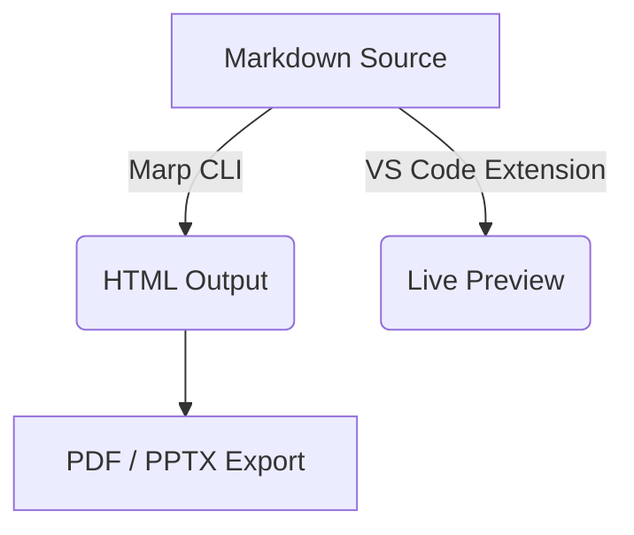

## Marp Learning Guide & Curriculum

Here is the complete content for your Marp learning series, broken down into the 8 files you requested. Each file is formatted in Markdown with Marp-specific directives and best practices.

---

### `01-installation.md`

```markdown
---
marp: true
theme: default
paginate: true
---

# Part 1: Installation & Setup

Welcome to **Marp** (Markdown Presentation Ecosystem). This guide will get your environment running in minutes.

---

## Prerequisites

To use Marp effectively, you need:
1. **VS Code** (Visual Studio Code) installed on your machine.
2. A basic understanding of Markdown (`#`, `*`, `-`, etc.).

---

## Step 1: Install the Marp Extension

1. Open VS Code.
2. Go to the **Extensions** view (`Ctrl+Shift+X` or `Cmd+Shift+X`).
3. Search for **Marp for VS Code** (by marp-team).
4. Click **Install**.

---

## Step 2: Create Your First Presentation

Create a new file named `index.md` and add the frontmatter directives at the top:

```markdown
---
marp: true
---

# Hello Marp!
This is my first slide.

```

---

## Step 3: Previewing and Exporting

* **Toggle Preview:** Press `Ctrl+K V` (Windows/Linux) or `Cmd+K V` (Mac) to open the live preview pane.
* **Export Slides:** Click the Marp icon in the top-right corner of the editor or use the Command Palette (`Ctrl+Shift+P` / `Cmd+Shift+P`) and type `Marp: Export Slide Deck`.
* **Formats supported:** PDF, HTML, and PPTX.

```

---

### `02-basic-slides.md`
```markdown
---
marp: true
theme: default
paginate: true
---

# Part 2: Basic Slides & Markdown Syntax

---

## Slide Separation

Marp uses horizontal rules (`---`) to separate individual slides.

```markdown
# Slide 1
Content for slide 1.

---

# Slide 2
Content for slide 2.

```

---

## Standard Markdown Support

You can use all standard Markdown features:

* **Bold** and *Italic* text
* [Links](https://marp.app)
* Inline code like `marp --pdf presentation.md`

> Blockquotes are also fully supported and styled nicely by default themes.

---

## Lists and Tables

### Ordered vs Unordered

1. First item
2. Second item
* Sub-bullet A
* Sub-bullet B


### Simple Table

| Command | Description |
| --- | --- |
| `marp` | Run CLI compiler |
| `-p` | Preview mode |

```

---

### `03-layouts.md`
```markdown
---
marp: true
theme: default
paginate: true
---

# Part 3: Layouts & Directives

---

## Scoped Directives vs Global Directives

* **Global Directives** (at the top of the file) apply to the whole deck.
* **Scoped Directives** (`<!-- _directive: value -->`) apply **only** to the current slide. Notice the leading underscore!

---

## Directives: Background Colors

```markdown
---
marp: true
---

# Normal Slide

---
<!-- _backgroundColor: #1a1a1a -->
<!-- _color: #ffffff -->

# Dark Mode Slide
Custom background and text colors applied locally.

```

---

## Split Columns (Using HTML/CSS)

For multi-column layouts, use basic HTML structures supported by Marp:

### Column Left

* Bullet point one
* Bullet point two

### Column Right

* Feature A
* Feature B

```

---

### `04-images-and-diagrams.md`
```markdown
---
marp: true
theme: default
paginate: true
---

# Part 4: Images & Diagrams

---

## Local and Remote Images

Standard Markdown image syntax works out of the box:

```markdown


# Split Screen Image
Using `bg left` places the image as a background element on the left side of the slide while keeping text on the right.

```

---

## Advanced Image Scaling

Control image sizing easily using width and height parameters:

```markdown


```

---

## Mermaid.js Diagrams

Marp natively supports Mermaid diagrams via code blocks if enabled or rendered through extensions:



```

---

### `05-speaker-notes.md`
```markdown
---
marp: true
theme: default
paginate: true
---

# Part 5: Speaker Notes

---

## Adding Notes to Slides

Speaker notes are added using HTML comment syntax (`<!-- Note: ... -->` or `<!-- notes: ... -->`) directly inside your slide content.

```markdown
# Slide Heading
Visible slide content goes here.

<!--
Speaker Notes:
- Remember to introduce the core concept first.
- Transition into the live demo after this slide.
-->

```

---

## Viewing Speaker Notes

* **During Presentation:** Use the Marp CLI or supported presentation modes (like Marp CLI's built-in preview server) to view notes in real-time.
* **Exporting:** When exporting to HTML or PDF, notes remain hidden from the audience view but can be accessed through specific presentation interfaces.

```

---

### `06-theme-customization.md`
```markdown
---
marp: true
theme: default
paginate: true
---

# Part 6: Theme Customization

---

## Built-in Themes

Marp comes with three core themes out of the box:
1. `default` - Clean, professional, corporate feel.
2. `gaia` - Warm, friendly, organic tones.
3. `uncover` - Minimalist, bold slide design suited for punchy talks.

Change your theme globally using frontmatter:
```markdown
---
marp: true
theme: gaia
---

```

---

## Writing Custom CSS

You can style your presentation directly inside a `<style>` tag:

```markdown
---
marp: true
theme: default
---

# Custom Styled Slide

<style>
section {
  background-color: #f0f4f8;
  font-family: 'Helvetica Neue', sans-serif;
}
h1 {
  color: #2b6cb0;
}
</style>

```

```

---

### `07-organizational-template.md`
```markdown
---
marp: true
theme: gaia
_class: lead
paginate: true
header: "Internal Engineering Review | Q3 2026"
footer: "Confidential - Internal Use Only"
---

# Engineering Sync
### Quarterly Review & Roadmap

---

## Agenda

1. System Architecture Overview
2. Key Milestones Achieved
3. Q4 Objectives & Goals
4. Open Discussion & Q&A

---

## Architecture Overview

* **Core Services:** Migrated to containerized microservices.
* **Performance:** Reduced average latency by **34%**.
* **Reliability:** Maintained `99.99%` uptime across all regions.

---

## Q4 Objectives

| Milestone | Target Date | Owner |
| :--- | :--- | :--- |
| Zero-Trust Security Audit | Nov 2026 | SecOps |
| Global Edge Deployment | Dec 2026 | Platform Team |

```

---

### `08-presentation-playbook.md`

```markdown
---
marp: true
theme: uncover
paginate: true
---

# Part 8: Presentation Playbook

Best practices for building and delivering Marp decks.

---

## 1. Structure for Impact

* **One idea per slide:** Avoid cluttering your viewers' screens with dense blocks of text.
* **Use progressive disclosure:** Break complex lists into smaller chunks or use multiple slides.
* **Embrace whitespace:** Let your typography breathe.

---

## 2. Version Control (Git)

Because Marp presentations are plain text Markdown files:
* Track changes seamlessly using **Git**.
* Collaborate with teammates via Pull Requests.
* Review structural edits line-by-line in code reviews.

---

## 3. Automation & CI/CD

Automate PDF/HTML builds using GitHub Actions:

```yaml
name: Build Slides
on: [push]
jobs:
  build:
    runs-on: ubuntu-latest
    steps:
      - uses: actions/checkout@v4
      - name: Compile Marp Deck
        uses: marp-team/marp-action@v3
        with:
          pdf: true

```

```

```